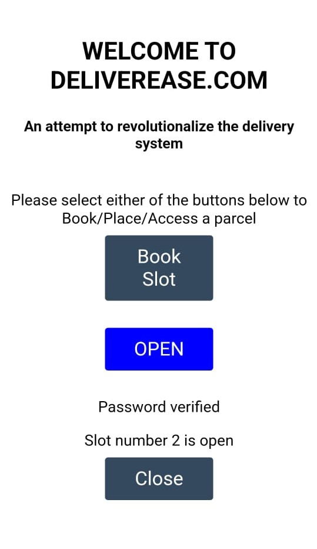
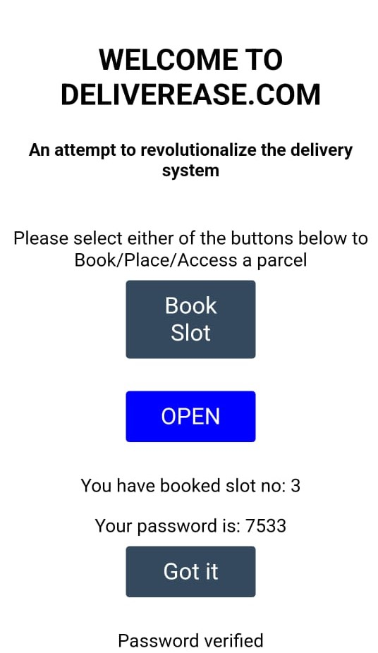

# IOT_BASED_SMART_RECEPTION_UNIT

We developed a website and hosted it on a NodeMCU(ESP-12E) and interfaced it with the servo motors. Through this website the student of college campus or the users were able to book slots on the reception unit and the delivery man could safely deploy the parcel in it. The whole process was authorized by a unique 4-digit password each time the student or the user books a slot. 
## Screenshots

<table>
  <tr>
  </tr>
  <tr>
    <td></td>
    <td></td>
    
  </tr>
 </table>

